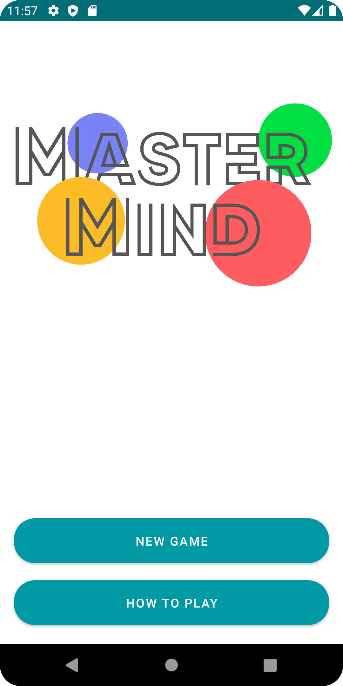
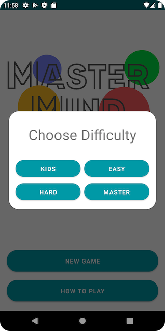
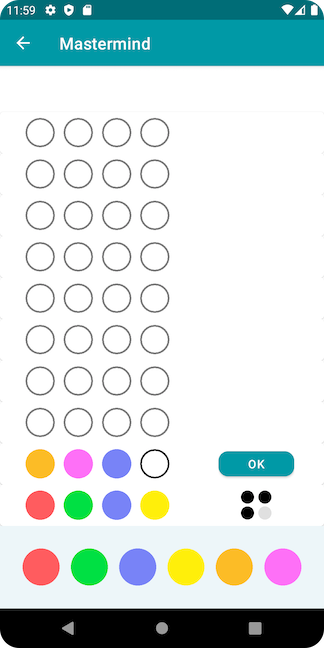
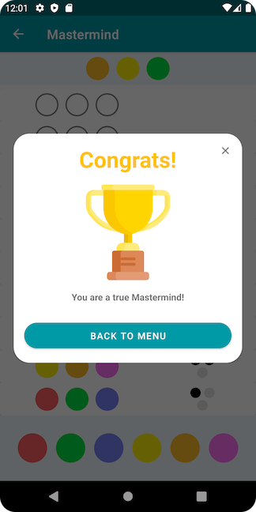
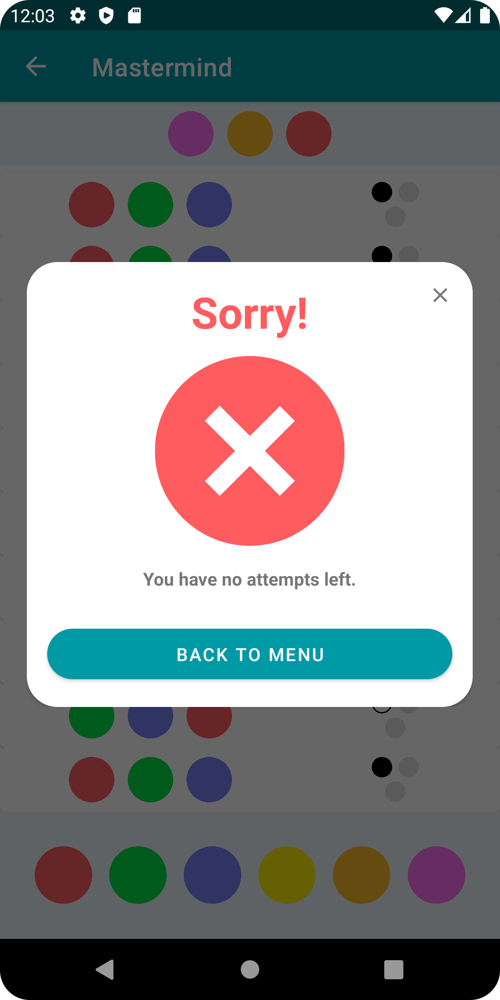

# Mastermind

This project was created by [David Ebner](https://github.com/alldavelong) and [Tobias Maier](https://github.com/maiertbi) during the third semester at the university of applied sciences Kufstein, Austria.

The original Mastermind (or Master Mind) was a board game for two players where one of them tries to decipher the code the other one has come up with. For more information about the game visit [Wikipedia](https://en.wikipedia.org/wiki/Mastermind_(board_game)).

The app "Mastermind" is an interpretation of this famous board game with the catch that no second player is needed. The program itself determines the pattern to be cracked and the player has to guess is with the received feedback from his previous guesses.

## the app itself

This app has a minimalistic design and everything is fully animated - every button press, every pop-up as well as every Drag'n'Drop.

  

At the beginning you can choose between the game itself or the ruleset. When choosing the first option you'll get to choose between different difficulties. Then you can start the game by dragging the color balls to the field you think is correct. After you finish your round you only have to press "OK" to let the program check your input.

If you guessed it correctly you will get the winningScreen or the game is over if there are no turns left.

 
